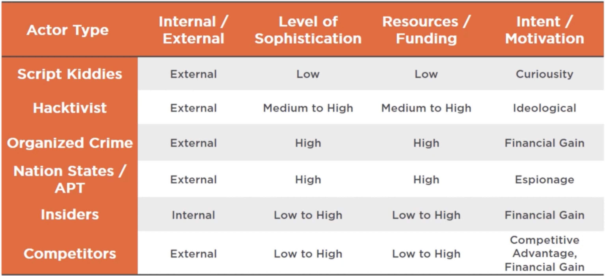

# Attacks, Threats, and Vulnerabilities
*Note: Much of the below information is summarized from Christopher Rees' Security+ training course hosted on Pluralsight. Much credit goes to Chris' expertise! Check out his courses in the sources*

CompTIA's Security+ certification is a cert that many receive at the beginning of their journey into cybersecurity to prove their competency of basic security principles. Having taken and passed the exam, I condensed all of my notes for easy reference and to allow anyone to use them to help study. The exam breaks down its curriculum into several sections, and this portion of my notes covers the "Attacks, Threats, and Vulnerabilities" content.
Please keep in mind these are only my notes, and should not be used as the sole resource to study for the Security+ certification. Additionally, since taking the exam, a new version has been published (SYO-701), meaning some of the below content may be out of date/missing important details.

## Table of Contents
- [Attacks, Threats, and Vulnerabilities](#attacks-threats-and-vulnerabilities)
  - [Table of Contents](#table-of-contents)
  - [Social Engineering](#social-engineering)
    - [Definitions](#definitions)
    - [Principles (Reasons for Effectiveness):](#principles-reasons-for-effectiveness)
  - [Malware](#malware)
    - [Definitions](#definitions-1)
  - [Application Attacks](#application-attacks)
    - [Definitions](#definitions-2)
  - [Network Attacks](#network-attacks)
    - [Definitions](#definitions-3)
    - [Networking Protocols](#networking-protocols)
  - [Threat Actors, Vectors, and Intelligence Sources](#threat-actors-vectors-and-intelligence-sources)
    - [Definitions](#definitions-4)
    - [Attack Vectors](#attack-vectors)
  - [Vulnerabilities and Security Risks](#vulnerabilities-and-security-risks)
    - [Definitions](#definitions-5)
    - [Weak Configuration Considerations](#weak-configuration-considerations)
    - [Impact Areas](#impact-areas)
  - [Security Assessment Techniques](#security-assessment-techniques)
    - [Definitions](#definitions-6)
    - [Types of Threats](#types-of-threats)
    - [Threat Intelligence Classifications](#threat-intelligence-classifications)
    - [Stages of Risk Management](#stages-of-risk-management)
    - [Risk Management Data Sources](#risk-management-data-sources)
  - [Penetration Testing](#penetration-testing)
    - [Definitions](#definitions-7)
    - [Testing Environments](#testing-environments)
    - [Security Teams](#security-teams)
  - [Sources](#sources)

## Social Engineering
### Definitions
- **Social Engineer**: someone who is a master of asking seemingly non-invasive/unimportant questions to gather information over time
- **Phishing**: obtaining sensitive information by tricking a user into entering their info into a fake website
- **Smishing**: phishing attack but through SMS
- **Spear Phishing**: phishing where the target is well researched and the attempt appears to come from a trusted sender
- **Whaling**: phishing campaign that targets the "big fish" in an organization (goal is to get information on wire transfers, tax information, and other financial data)
- **Vishing**: voice phishing (on phone/voicemail) where an attacker poses as a legitimate company/repair person/security personal/someone of trust in order to gather personal/sensitive information
- **Spam**: sending large quantities of unsolicited emails (typically for commercial advertising)
  - About 85% of emails are spam
- **SPIM** SPAM over Instant Messaging. Can be more effective as it happens over real time
- **Dumpster Diving**: removing trash from dumpsters that can reveal sensitive information
- **Shoulder Surfing**: social engineering trick to get someone to enter credentials into an application/website while watching them do so
- **Tailgating**: following someone into a building through a gated area or badged access area
- **Pharming**: redirecting a user's website traffic to a fake, malicious website
- **Hoaxes**: social engineering technique using phone/voicemail to trick the target into providing sensitive information
  - Types of hoaxes include: phishing, spear phishing, vishing, etc
- **Prepending**: adding mentions (@username) to tweets or social media posts to make them seem more personal
- **Impersonation**: pretending to be someone else via social engineering, stolen credentials/credential harvesting, infiltrating network and replaying captured packets
- **Invoice Scam**: whaling technique where bad actors spoof executive email accounts to contact finance/accounts payable and ask to pay a fraudulent invoice (wire transfer, company credit card, cryptocurrency, etc)
- **Identity Fraud/Theft**: malware, social engineering, dumpster diving is used to gather someones personal information which is then used without the owner's knowledge/consent
- **Credential Harvesting**: done via phishing campaigns, malware, pastebin/paste services in order to gather credentials at a large scale
- **Watering Hole Attack**: sophisticated attack that identifies less secure websites users in a company/organization are likely to visit to plant malware to scan targeted users/victims for system vulnerabilities
- **Typo Squatting/URL Hijacking**: Setting up domain names to capitalize on typos in website urls (i.e. Facbook.com vs Facebook.com). Fake websites are set up resemble the real ones. May include ad portals full of ads that appeal to a users visiting that website
- **Hybrid Warfare**: combination of traditional and irregular forces in the same military campaign with the same aim/political goal
- **Influence Campaigns**: using social media to shape public opinion such as helping/hurting company image, stock price, consumer confidence, public policy, elections, law enforcement, etc
### Principles (Reasons for Effectiveness):
1. Authority: the bad actor appears to know what they are talking about/has special knowledge of the company (i.e. has a position of authority)
2. Intimidation: the bad actor is able to impose their will on the target (i.e. threats)
3. Consensus/Social Proof: targets will act when they believe they are in alignment with the larger group
4. Familiarity/Liking: targets are more likely to complete actions they are already familiar with (i.e. buy things they like, talk with people similar to them/have a same contact, etc.)
5. Trust: targets are more likely to act when they trust a person/situation
6. Scarcity/Urgency: bad actors will make the target feel they must act quickly or risk missing out/gaining an advantage

## Malware
### Definitions
- **Malware**: any software that impairs the intended functionality of a system
    - Serves the purposes of the software's author rather than the system's user
- **Indicator of Compromise (IOC)**: artifacts observed that indicate *(with a high degree of confidence)* a computer intrusion
    - Potential indicators: unusual *outbound* network traffic, *DNS* request anomalies, mismatch *port-application* traffic, anomalies in *privileged user account* activity
- **Virus**: malicious code that *requires user interaction* to install and replicate
- **Crypto-malware/Ransomware**: malicious applications that *scare* or *scam* users into taking some type of *action*
    - Typically paying the creator for the *removal* of the ransomware/decryption of files
- **Trojan/Remote Access Tool (RAT)**: seemingly friendly software that contains *hidden* malicious software
- **Worms**: self-replicating program that is usually self-contained and can execute and spread *without user interaction*
    - **Network Service Worm**: exploits network vulnerability to propagate and infect others
    - **Mass Mailing Worm**: exploits email systems to spread and infect others
- **Potentially Unwanted Program (PUP)**: applications that are typically downloaded as part of another program (i.e. adware, spyware, etc.)
- **Fileless Virus**: malware that operates in memory (not stored in a file/installed on a machine)
    - Typically hooks into Windows PC via PowerShell or WMI
- **Botnet**: malicious code that infects *large numbers* of hosts for the purpose of launching *large scale attacks* on *specific targets*
    - Can be located *anywhere* in the world, with one or more Command and Control (C&C) servers
- **Logic Bomb**: malicious code that triggers after a period of time based on some date or *specific activity*
- **Spyware**: malicious software that captures *user activity* and reports back
- **Keylogger**: a malicious application that once installed on a host can capture all keystrokes which can be uploaded to a remote location, emailed, or stored locally for later retrieval
- **Rootkit**: malicious code that installs itself at the *OS* or *Kernel* level to avoid detection
- **Backdoors**: software that installs for the purpose of opening ports and installing *additional software*
- **Spraying**: a brute force type of attack (can be used with dictionary attacks or database of compromised passwords) that feeds a large number of usernames into a program that loops through passwords
- **Brute Force Attack**: systematic approach to trying every possible combination of passwords/passphrases
- **Dictionary Attack**: using known words (words in a dictionary/predefined set of possible words) to try and defeat a cipher
    - **Hybrid Attack**: combination of dictionary attack along with word variations
- **Rainbow Table**: precomputed table to *reversing* cryptographic hashes (a unique table is needed for each type of hash)
- **Password Salting**: adding random data to the hashing algorithm so that each users hash is *unique* even if both have the same password
- **Birthday Attack**: brute force attack that works on the idea that given enough time, two independent sources could yield the same hash (varies based on the hash algorithm)
- **Downgrade Attack**: attack that forces a system to negotiate down to a lower-quality (less secure) method of communication
    - Typically allowed to enable communication with legacy systems
-   **Adversarial Artificial Intelligence**: technique to fool models by supplying deceptive (tainted) input
-   **Supply Chain Attack**: attack on an organization by targeting less-secure elements in a supply network

## Application Attacks
### Definitions
- **Privilege Escalation**: obtaining elevated privileges (i.e. administrator or root) on a target
- **Cross Site Scripting (XSS)**: technique used to hijack sessions by having the browser run malicious code served from a site it trusts
    - **Non-Persistent**: specially crafted on the client side (generally in a URL, email, blog post, etc.)
    - **Document Object Model (DOM) Based**: can be persistent or non-persistent
    - **Persistent**: the attack is based on the server side where an attacker doesn't need to actively target a user and the site itself is infected
- **Structured Query Language (SQL) Injection**: modifying the SQL query that's passed to a web application to add code into a data stream
- **Dynamic Link Library (DLL) Injection**: process of inserting code into a running process by:
    1. Attaching to the process
    2. Allocating memory within the process
    3. Copying the DLL/DLL Path into the processes memory and determine appropriate memory addresses
    4. Instruct the process to execute the DLL
- **Lightweight Directory Access Protocol (LDAP) Injection**: modifying the query passed to the web server to include malicious query statements/code in order to access the "address book" of user accounts user to authenticate users
- **XML Injection**: attack that manipulates the logic of an XML application or service by injecting XML into a statement
- **Pointer Dereference**: vulnerability that can cause an application to throw an exception error, which can result in the application crashing
- **Buffer Overflow**: attack that causes a system or app to crash or behave unexpectedly by having calls or pointers to jump to a different address than what was intended
- **Race Condition**: occurs when a pair of routine programming calls in an application do not perform in the sequential manner that was intended
    - **Time of Check to Time of Use (TOCTTOU)**: type of race condition where an attacker gains access *prior* to an authentication check by inserting code/altering authentication to disrupt the normal authentication process
- **Replay Attack**: an attack that captures packets via sniffing the wired/wireless network and puts them back on the wire
- **Integer Overflow**: condition that occurs when the result of an arithmetic operation exceeds the maximum size integer type used to store it which allows the interpreted value to "wrap around" the max value and start at the min value
- **Cross Site Request Forgery (CSRF/XSRF)**: exploiting a website's trust in a user by stealing a victim's valid cookie after recently visiting a website
    - The server performs an action because it was sent a request from a client it trusts
- **Resource Exhaustion**: an attack where a malicious user executes code or processes on a machine over and over until all resources are exhausted (DoS, DDoS)
- **Memory Leak**: typically an unintentional consumption of memory that the application fails to release once it's no longer needed
- **Secure Sockets Layer (SSL) Stripping**: a Man in the Middle type of attack that strips away SSL encryption to enable an attacker in intercept traffic between victim and target
- **Refactoring**: modifying an application's source code without changing the underlying functionality for the purpose of fixing bugs, patching code, and tightening up security
- **Pass the Hash**: harvesting a user's password hash to authenticate to a remote server or service
- **Driver Attack**: application version of supply chain attacks (such as getting a malware packet signed and trusted to avoid detection)

## Network Attacks
### Definitions
- **Rogue Access Point**: when an attacker adds a point of access on a corporate network to steal/intercept data
    - **Evil Twin**: a rogue access point that is impersonating a legitimate access point using the same SSID
- **Bluejacking**: sending unauthorized messages or data to a victim's device via Bluetooth technology
    - Typically sending a vCard containing a message in the name field to another Bluetooth-enabled device bia tha Object Exchange (OBEX) protocol
- **Bluesnarfing**: pulls data off of the victim's device through Bluetooth (opposite of bluejacking)
- **Dissociation**: sending a spoofed disassociation frame to create a DoS scenario on a wireless network
- **Jamming**: sending out excessive RF noise which can make Wi-Fi channels unusable (illegal in most places)
- **Near Field Communication (NFC)**: technology to allow communication between devices within close procimity to each other (~3-4")
    - Two-way communication (vs RFID which is one way)
- **Initialization Vector (IV) Attack**: when weaker encrypted networks are flooded and sniffed to find repeated IVs, derive it, and gain access
- **On-Path Attacks**
    - **Man-in-The-Middle (MiTM)**: when an attacker is able to capture network traffic to replay/manipulate it for the intended target
    - **Man-in-the-Browser (MiTB)**: when an attacker gets malware on a victim's device that sits and waits for them to go onto certain sites that the malware will steal data from/perform unauthorized actions
- **ARP (Cache) Poisoning**: when an attacker sends out spoofed ARP messages onto a LAN to associate their machine with another hose IP which allows the attacker to intercept data intended for another recipient
- **IP/MAC Spoofing**: masquerading as another device using their IP or MAC address via spoofing
- **MAC Flooding**: when an attacker floods a network switch with ethernet frames to replace stored MAC addresses in the MAC table with their own devices, allowing them to receive all of the data intended for the original MAC address destinations
- **MAC Cloning/Spoofing**: change the MAC address of a network interface card
- **DNS (Cache) Poisoning**: manipulating the data in a DNS server;s cache to point to different IP addresses
- **Distributed Denial of Service (DDoS)**: large scale attack against a target by botnets or similar distributed devices. Goal is to slow down the target server/network to the point of being unusable
    - **Smurf Attack**: when a victim's IP address is spoofed and ICMP messages are broadcast to a computer network where recipients will respond with a reply to and flood the victim's IP
### Networking Protocols
- **IP (Internet Protocol)**: *connectionless* protocol that is responsible for network addressing. Provided routing of packets between networks
- **TCP (Transmission Control Protocol)**: *connection* oriented protocol that established connections between endpoints. Provides guaranteed delivery of packets
- **UDP (User Datagram Protocol)**: *connectionless* oriented protocol with no guarantee of delivery (best effort)

## Threat Actors, Vectors, and Intelligence Sources
### Definitions
- **Script Kiddies**: hackers that are relatively new or unskilled
- **Hacktivists**: hackers motivated by ideology or some social/political cause
- **Organized Crime**: hackers who are motivated by financial crime
- **Nation States/Advanced Persistent Threats (APT)**: highly skilled hackers whose main goal is to penetrate government or commercial systems
- **Insiders**: individuals who belong to a company/organization that chooses to defame/reveal information about said company often for financial gain

- **Indicators of Compromise (IOC)**: pieces of data (breadcrumbs) that can identify potential malicious activity
- **Automated Indicator Sharing (AIS)**: free sharing service by the DHS to share indicators between the federal government /private sector at machine speed over STIX and TAXII specifications
- **MITRE**: not-for-profit organizations that manages federal funding for research projects across multiple agencies (CVE/CWE databases)
    - **MITRE ATT&CK (Adversarial Tactics, Techniques and Common Knowledge) Framework**
        - **Trusted Automated Exchange of Indicator Information (TAXII)**: transport protocol that allows sharing of threat intelligence information over HTTPS using APIs
        **Structured Threat Information Expression (STIX)**: standardized format for presenting threat intelligence information
### Attack Vectors
- Direct Access: physical access, on-site, theft/removal
- Wireless: captive portal, evil twin, network swimming
- Email: malware, malicious links, phishing/whaling
- Supply Chain: weak link, downstream attacks
- Social Media: malicious links, phishing, social proof, group consensus
- Removable Media: USB sticks, CF cards, CD/DVD, malware/ransomware
- Cloud: cloud provider vulnerabilities, DDoS, multi-tenancy

## Vulnerabilities and Security Risks
### Definitions
- **Non-repudiation**: being able to identify and validate user activity
- **Cipher Suite**: bundled together cryptographic algorithms used in a connections containing:
    - Key exchange
    - Authentication
    - Encryption
    - Integrity algorithm
### Weak Configuration Considerations
- Open permissions
- Unsecured root accounts
- Errors (how they are handled)
- Unsecure protocols
- Default settings
- Open ports and services
### Impact Areas
- Data Loss
- Data Breaches
- Data Exfiltration
- Identity Theft
- Availability Loss

## Security Assessment Techniques
### Definitions
- **Threat**: possible danger that can be used to exploit an existing vulnerability (via breach) with intent to cause harm to systems, networks, or entire organizations (can be external or internal)
- **Tactical Cyber Intelligence**: involves specific actions being taken to defend networks against malicious actors attempting infiltration. Relies on devoted resources to strategic and operational levels
- **Operational Cyber Intelligence**: assesses the organization's operating environment to identify indicators and warnings of potential cyber risks
- **Strategic Cyber Intelligence**: requires senior leadership to determine objectives and guidance based on what is known of potential adversaries and what security posture is already in place, in order to successfully assess threats
- **Credentialed Access Testing**: has easier access and *less impact* on tested systems as well as more accurate results
- **Non-credentialed Access Testing**: required more resources as it may require brute-force/multiple approaches to gain access
- **Common Vulnerabilities and Exposures (CVE)**: reference for publicly known information security vulnerabilities maintained by the MITRE Corporation
- **Common Vulnerability Scoring System (CVSS)**: open frameworks for communicating the characteristics and severity of software vulnerabilities
- **CVSS**: maintained by Forum of Incident Response and Security Teams (FIRST) and is used to assess the principal characteristics of a vulnerability and produce a numerical score reflecting its severity
- **Security Information and Event Management (SIEM)**: software suites that provide the following:
    - Collects data
    - Aggregates the data
    - Analyzes normalized data for anomalies, threats, and trends
    - Investigates alerts, identifies breaches, and takes action
    - Remediates discovered vulnerabilities
    - Reports on risk and compliance
- **Security Orchestration, Automation, and Response**: complements SIEM by aggregating all tools within a SOC and providing automated playbooks
    - Ticket creation, case management, etc.
    - Integrations with 3rd party products
### Types of Threats
- Physical Damage
- Natural Events
- Loss of Essential Services
- Compromise of Information
- Technical Failures
- Compromise of Functions
### Threat Intelligence Classifications
- **Unknown-Unknown**: unaware of a threat's existence, little chance to deter/remediate
- **Known-Unknown**: threat that is known, but not fully understood (how it works, intention, etc.)
- **Known-Known**: threats that are known and fully understood, an outcome can be directed to deter/mitigate a threat
### Stages of Risk Management
- Assessing Requirements: understanding the business and IT objectives and how security can meet those objectives
    - IT and Security Operations should align and enable business outcomes, *not* drive them
- Aligning with Current Capabilities: understand what's available today and what capabilities exist across people, process, and technology
- Creating Plans and Initiatives: quantify existing gaps and develop plans to prioritize initiatives and fill the gaps
- Creating Metrics and Monitoring Progress: develop metrics to track progress and ensure programs are meeting business requirements
### Risk Management Data Sources
- Internal Sources
    - Internal audits
    - Known Issues
    - Previous security incidents
- Threat Intelligence
    - Attack frequency
    - Cost to company
    - Emerging bad actors/Targets
- Contextual Data
    - Industry
    - Technology
    - Geography
    - Attack Method

## Penetration Testing
### Definitions
- **Penetration (Pen) Testing**: the practice of testing a computer system, network, or web application to find vulnerabilities that an attacker could exploit
    1. Establish Goals/Set Parameters
    2. Reconnaissance/Discovery
    3. Exploitation/Brute Force
    4. Take Control/Escalate Privilege
    5. Pivoting
    6. Data Collections/Reporting
- **Rules of Engagement (ROE)**: terms that clearly define what is in-scope for the engagement
    - What activities are allowed/prohibited
    - Key stakeholders
    - Relevant contact lists
    - Communication methods/frequency
    - Handling of sensitive data
    - Specific goals/definition of success
- **Persistence**: installing backdoors or methods to maintain access to a host/network
- **Bug Bounty**: program that encourages users to find and report bugs and rewards them with recognition/compensation
- **Pivoting**: a technique that allows lateral movement from a compromised host
    - *Foothold* is gained on a target system
    - Compromised target system is leveraged to compromise other, normally inaccessible systems
- **War Flying**: using airplanes, drones, or UAV to sniff Wi-Fi networks, calculate GPS coordinates, and provide aerial imagery
    - Flight time can last up to 30-45min
- **War Driving**: using a vehicle to actively seek out wireless access points with little to no security (open, WEP, WPA)
### Testing Environments
- **Unknown Environment**: tester is given little to no information about the target. More "real world" but also more time consuming and more expensive
- **Known Environment**: tester is given full disclosure about the target (i.e. network, hosts, source code, protocols, diagrams, etc.)
- **Partially Known Environment**: combination of known/unknown where a tester is given partial information about the target, but not access to documentation or data
### Security Teams
- **Red Team (Attackers)**: offensive security, ethical hackers, pen testers
- **Blue Team (Defenders)**: defensive security, infrastructure protection, DFIR
- **Purple Team (Collaborators)**: facilitate collaboration, improve skills of both teams
- **White Team (Managers)**: define the rules of engagement, manage engagement

## Sources
- [Official CompTIA Security+ Site](https://www.comptia.org/certifications/security)
- [Pluralsight Security+ (SYO-601) Course](https://www.pluralsight.com/paths/comptia-security-sy0-601)
- [Christopher Rees Pluralsight Bio](https://www.pluralsight.com/authors/chris-rees)