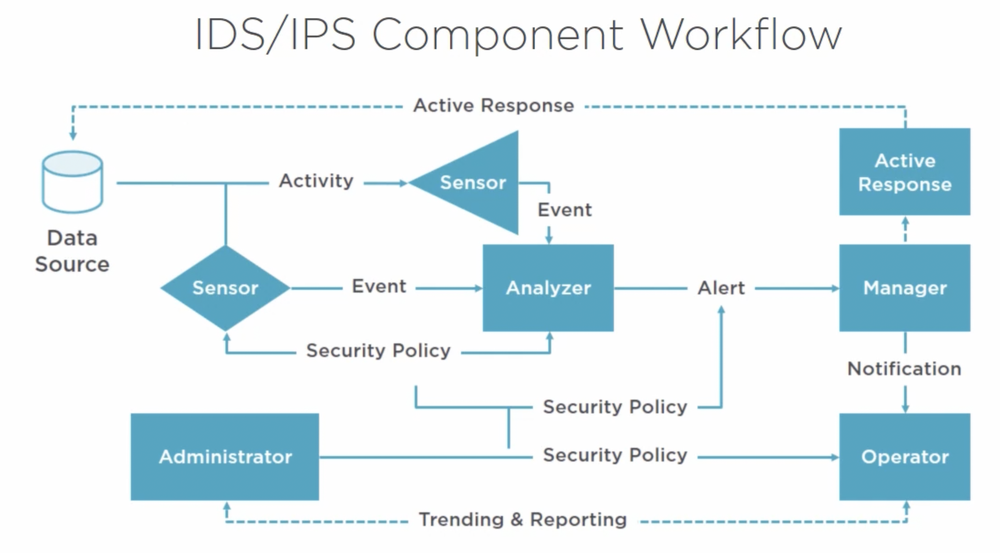

*Note: Much of the below information is summarized from Christopher Rees' Security+ training course hosted on Pluralsight. Much credit goes to Chris' expertise! Check out his courses in the sources*

Continuing with my notes from studying for the CompTIA Security+ exam. The exam breaks down its curriculum into several sections, and this portion of my notes covers the "Implementation of Secure Solutions" content.
Please keep in mind these are only my notes, and should not be used as the sole resource to study for the Security+ certification. Additionally, since taking the exam, a new version has been published, meaning some of the below content may be out of date/missing important details.

- [Implementation of Secure Solutions](#implementation-of-secure-solutions)
  - [Implementing Secure Protocols](#implementing-secure-protocols)
    - [Definitions](#definitions)
    - [Use Cases](#use-cases)
  - [Host and Application Security Solutions](#host-and-application-security-solutions)
    - [Definitions](#definitions-1)
    - [Endpoint Detection and Response (EDR)](#endpoint-detection-and-response-edr)
  - [Implementing Secure Network Designs](#implementing-secure-network-designs)
    - [Definitions](#definitions-2)
    - [Segmentation Modules](#segmentation-modules)
    - [Proxies](#proxies)
    - [IDS Approaches](#ids-approaches)
    - [Types of Firewalls](#types-of-firewalls)
  - [Installing and Configuring Wireless Security Settings](#installing-and-configuring-wireless-security-settings)
    - [Definitions](#definitions-3)
  - [Implementing Secure Mobile Solutions](#implementing-secure-mobile-solutions)
    - [Definitions](#definitions-4)
    - [Securing Wi-Fi](#securing-wi-fi)
    - [Application Security Policies](#application-security-policies)
  - [Cybersecurity Solutions in the Cloud](#cybersecurity-solutions-in-the-cloud)
    - [Definitions](#definitions-5)
    - [Secrets Management](#secrets-management)
      - [Best Practices](#best-practices)
    - [The Cyber Kill Chain](#the-cyber-kill-chain)
  - [Identity and Account Management Controls](#identity-and-account-management-controls)
    - [Definitions](#definitions-6)
    - [Authentication Factors](#authentication-factors)
    - [User Access Best Practices](#user-access-best-practices)
  - [Authentication and Authorization Solutions](#authentication-and-authorization-solutions)
    - [Definitions](#definitions-7)
    - [Access Control Types](#access-control-types)
  - [Public Key Infrastructure](#public-key-infrastructure)
    - [Definitions](#definitions-8)
    - [Types of Certificates](#types-of-certificates)
    - [Certificate Formats](#certificate-formats)
    - [Trust Models](#trust-models)
  - [Sources](#sources)

# Implementation of Secure Solutions
## Implementing Secure Protocols
### Definitions
- **DNS Security Extensions (DNSSEC)**: adds security to the original DNS specification by providing a chain of trust via secured signed keys from the DNS server
    - DNS was not originally designed with security mechanisms in place and was instead meant to be massively scalable
    - Responses from DNSSEC servers (protected zones) are digitally signed, authenticating their origin
- **Secure Shell (SSH)**: cryptographic network protocol for doing things securely over an unsecured network, often signing on to remote hosts (connects over TCP port 22)
- **Secure/Multipurpose Internet Mail Extensions (S/MIME)**: public key encryption and signing of MIME data (emails)
- **Secure Real-Time Transport Protocol (SRTP)**: security protocol for RTP that adds confidentiality, message authentication, and replay protection to that protocol (secure VoIP traffic)
- **Lightweight Directory Access Protocol over SSL (LDAPS)**: secures traffic between client and server over SSL/TLS via TCP/UDP port 636
- **File Transfer Protocol over SSL (FTPS)**: secure file transfers that use SSL for encryption via TCP ports 989 and 990
- **SSH File Transfer Protocol (SFPT)**: provides remote file transfer, access, and management via FTP tunneled through an SSH connection (TCP port 22)
- **Simple Network Management Protocol Version 3 (SNMPv3)**: encrypting information for remote management and reporting of IP devices over UDP port 161
- **Secure Sockets Layer (SSL)**: adds confidentiality and data integrity to communications initiated via a handshake
    - **Transport Layer Security (TLS)**: newer version based on SSL
- **HTTPS**: authentication of visited websites as well as privacy/integrity of the data exchange over TCP port 443
- **Post Office Protocol POP**: accessing webmail securely using SSL/TLS over TCP port 110/995
- **Internet Message Access Protocol (IMAP)**: accessing webmail securely using SSL/TLS over TCP port 143/993
### Use Cases
- Voice and Video
- Time Synchronization
- Email and Web Browsing
- File Transfer
- Directory Services
- Remote Access
- Domain Name Resolution
- Routing and Switching
- Network Address Allocation
- Subscription Services

## Host and Application Security Solutions
### Definitions
- **Next-Generation Firewall (NGFW)**: go beyond traditional firewalls and offer advanced services such as deep packet inspection, application firewalls, intrusion detection/prevention, TLS/SSL inspection, and bandwidth management
- **Host-based IDS/IPS (HIDS/HIPS)**: similar in function to NIDS/NIPS but runs on a specific host
    - HIDS can detect anomalous behavior and alert while HIPS can detect but not take action
- **Secure Boot**: UEFI (universal extensible firmware interface)feature that allows only signed boot software to load
- **Measured Boot**: boot components have been identified cryptographically and are checked at boot to validate each component and provides a detailed log of everything
- **Integrity Measurement Architecture (IMA)**: open source alternative that creates a measured runtime environment with a list of components that need to load which is anchored to the TPM chip to prevent tampering
- **Universal Extensible Firmware Interface (UEFI)**: alternative to traditional BIOS with CPU-independent architecture and drivers
- **Fuzzing**: intentionally trying to crash a program or application by providing invalid, unexpected, or random data
- **Self-Encrypting Drives (SED)**: provide security with self-contained keys within the drive's firmware maintained separately from the CPU
    - **Opal Specification**: security subsystem class (SSC) specifies how data is encrypted on the drive
### Endpoint Detection and Response (EDR)
1. Monitor and collect activity data from endpoints
2. Analyze data to identify threats, patterns, or IOCs
3. Automatically respond to identified threats to remove or mitigate them, notify appropriate teams, etc.
4. Forensics and analysis tools to research threats and search for suspicious activities

## Implementing Secure Network Designs
### Definitions
- **Load Balancer**: dynamically balance the load between devices (typically servers but can also be other devices)
    - Could be hardware or software based
- **East-West Traffic**: data moving between devices within a data center
- **North-South Traffic**: data entering/exiting a data center
- **Zero Trust**: internal and external traffic should be monitored and nothing implicitly trusted
    - Micro-segmentation and granular access providing only the levels of permissions required
- **Split Tunnel**: allows a user to access one set of resources via Firewall/VPN and other resources directly
- **VPN Concentrator**: has the ability to create a large number of VPN tunnels, typically used for site-to-site architectures
- **Network Access/Admission Control (NAC)**: a set of policies that define a minimal set of requirements each device must have before being allowed on the network (i.e. anti-virus up to date, certain OS, applications, etc.)
    - **Permanent Agent**: persistent agent that is installed on the host device and runs continuously
    - **Dissolvable Agent**: agent that is run from a portal. Is only run once before removal/deactivation
    - **Agentless**: embedded within Active Directory, NAC code verifies the host complies with access policy
- **802.1x - EAPOL (Extensible Authentication Access Protocol over LAN)**: allows only EAPOL traffic over port until client authenticates with a RADIUS or authentication server
- **Loop Protection**: method that enforces a Time to Live (TTL) protocol on network packets to prevent packets from infinitely searching fro connection and flooding resources (for Layer 3/Network Layer protection)
- **Spanning Tree Protocol (STP)**: protections against resource flooding due to packet loops by having switches "clamp down" once broadcasts hits a certain percentage (for Layer 2/Data Link Layer protection)
    - **Root Bridge**: the elected enter of the network
    - **Designated Bridge**: forwarder that sends data to the Root Bridge
    - **Root Port**: port that sends data forward to the root bridge
- **DHCP Snooping**: layer 2 security technology that monitors for rogue DHCP servers
- **MAC Filtering**: predefines which MAC addresses can connect to the router or access point
- **Jump Server**: servers used to connect to devices in remote networks, typically for performing admin tasks in networks with limited connectivity
- **Intrusion Detection System (IDS)**: enables log alerts and events that allow for reactive response/research
- **Intrusion Prevention System (IPS)**: enables prevention features such as blocking IP addresses
- **Alert**: message generated from the analyzer indicating an "interesting" event has occurred
- **Analyzer**: processes data collected form one or more sensors and looks for suspicious activity
- **Data Source**: raw data being analyzed (i.e. log files, audit logs, system logs, network traffic, etc.)
- **Event**: indication that suspicious activity may have occurred (can trigger an Alert or notification)
    - If confirmed, the Event will become an Incident
- **Manager**: IDS console that is used to manage the system
- **Notification**: process by which the operator is alerted to an event or incident
- **Operator**: user, admin, etc. that is responsible for the IDS
- **Sensor**: primary data collection point for the IDS. Can be the device driver on a system or a separate physical device attached to the network to collect data

- **Unified Threat Management (UTM)**: multi-purpose suite of tools that provide some of the following - firewall, NIDS/NIPS, gateway anti-virus/spams, VPN, content filtering, load balancing, DLP
- **Content Filters**: hardware/software that limits or restricts access to certain types of content (i.e. inappropriate material, malware, spam, etc.)
- **Implicit Deny**: Firewall Access Control List (ACL) that specifies what type of traffic is allowed, denying what is not on the list
- **Quality of Service (QoS)**: a set of technologies to ensure critical applications or services have a certain level of performance
### Segmentation Modules
- **Physical**: where all nodes are physically connected to the same switches
- **Logical (VLAN)**: where all nodes are physically connected to the same switches, but logically organized/group as separate VLANs
    - Creates smaller collision domains which reduces chatter
- **Virtualization**: method of segmenting or isolating that can keep a host in a "sandboxed" environment while separating guests from the host hypervisor
- **Air Gapped**: method of isolating a computer or network from the internet/external networks
- **File Integrity Check**: check to protect against tampering by ensuring a file hasn't been modified by comparing the current state against a known good state(look at credentials, security settings, content, attributes, hash, etc.)
### Proxies
- **Forward Proxy**: sits between multiple users and the internet with the goal of speeding up connectivity by caching commonly used resources from users behind the proxy as well as protecting internal user info by using a proxy IP for external facing resources
    - Can also be configured as a NAT
- **Reverse Proxy (Load Balancer)**: sits between the internet and external resources in order to properly/efficiently divert incoming traffic as to not overwhelm resources
- **Transparent Proxy**: intermediary system that typically sits between a user and content provider for caching and filtering
    - **Gateway**: another possible setup of a transparent proxy that is rule based, typically requiring registration or user acceptance
- **Web Security Gateway**: proxy server with advanced features such as virus scanning, preventing connections to inappropriate sites, 3rd party cookies, and data loss prevention
    - Can also enable granular access to websites where access itself is allowed, but certain functionality of the site is blocked
### IDS Approaches
- Behavior Based Detection: look for variations in behavior (i.e. increase traffic, policy violations etc.)
- Signature Based Detection: uses attack signatures and audit trails
- Anomaly Detection: learn what is "normal" system behavior and then look for deviations from the baseline
- Heuristic: use algorithms to analyze traffic as it passes through the IDS
### Types of Firewalls
- **Packet Filtering**: allow block traffic based on port
- **Proxy Firewall**: dual-homed firewall that segments internal users from the outside world
- **Stateful Packet Inspection (SPI) Firewalls**: examines packet and keeps packet table of every communication channel. Tracks the entire conversation and only allows packets from known active connections
- **Web Application Firewall (WAF)**: designed with granular rules specifically to analyze traffic to webs servers and prevent typical attacks (operates on Layer 7/Application Layer)

## Installing and Configuring Wireless Security Settings
### Definitions
- **Wired Equivalency Protocol (WEP)**: designed to provide security equal to a wired network but has since been depreciated due to an emergence of vulnerabilities
    - An initialization vector attack/packet injection can crack WEP in several seconds (only 24-bit encryption)
- **Wi-Fi Protected Access (WPA/WPA2)**: based on WEP and used as a stop gap. WPA2 implements 802.11i protocol and provides additional security enhancements
- **Wireless Application Protocol (WAP)**: used to provide mobile devices wit internet connectivity with a suite of protocols similar to TCP/IP
    - Uses Wireless Transport Layer Security (WTLS)
- **Extensible Authentication Protocol (EAP)**: a set of authentication frameworks for wireless networks
    - **Lightweight Extensible Authentication Protocol (LEAP)**: proprietary protocol developed by Cisco as a stop gap to WEP and lacked windows support but has since been depreciated
        - Was very easy to configure with no digital certificates and clear text transmissions
    - **Protected Extensible Authentication Protocol (PEAP)**: joint development effort by Cisco, RSA, Microsoft that allows a digital certificate to be used on the authentication server and establishes encrypted channel between the client and server via a TLS tunnel
- **RADIUS Federation**: connects a common system of authentication and credentials database that can be used by multiple applications/platforms wirelessly
- **Wi-Fi Protected Setup (WPS)**: designed to make it easy for devices to join Wi-Fi networks with minimal effort with an 8 character pin (only 7 characters are used)
- **Captive Portal**: authentication/acceptance page typically found in open and public networks that requires the user to enter credentials, agree to acceptable use policies, make payment, etc. before granting access
    - Vulnerable to packet sniffing as once a user is authenticated, sniffed packets can determine the IP and MAC address to be spoofed for access
- **Fat (Thick) Access Point**: have everything needed to manage wireless clients
- **Thin Access Point**: just the radio/antenna and can be managed via a central switch
- **Stand-Alone Access Point**: provide everything required to service clients with limited encryption and typically no load balancing
- **Controller-Based Access Point**: meant for large scalability through central configuration and managements that includes load balancing and full-features IDS functionality

## Implementing Secure Mobile Solutions
### Definitions
- **Mobile Device Management (MDM)**: software that enables provisioning of mobile devices, application of policy, remote wiping, etc.
- **Mobile Application Management (MAM)**: more granular control over mobile devices (especially BYOD) where policy enforcement can be at the app level, along with application containerization
- **Unified Endpoint Management (UEM)**: evolution of MDM, EMM, and MAM that combines the features of several technologies along with being able to manage desktop and laptops
- **Security Enhanced Android (SEAndroid)**: Security Linux (SELinux) kernel security module to provide a mechanism for supporting access control security policies by restricting actions that installed software can take
### Securing Wi-Fi
- Disable the Security Set Identified (SIDD): will prevent clients who are browsing from discovering the network (not skilled hackers)
- MAC Filtering: predefines which MAC addresses can connect to the router or access point (won't prevent skilled hackers)
- Require Secure Connectivity Protocols: require WPA2-PSK (AES) as it uses a pre-shared key with Advanced Encryption Standard (AES) which is considered the most secure option currently
### Application Security Policies
- Authentication
- Geo-Tagging
- Biometrics
- Push Notification Services
- Encryption
- Key/Credential Management

## Cybersecurity Solutions in the Cloud
### Definitions
- **High Availability (HA)**: ensures a resources remains available even when sub-components fail
- **Next-Generation Secure Web Gateway (SWG)**: combines the features of multiple cybersecurity tools such as CASB, DLP, activity controls, and being instance aware
### Secrets Management
Tools and methods for managing digital authentication credentials (secrets)
#### Best Practices
- Authenticate all access requests that use non-human credentials
- Enforce the principle of least privilege
- Enforce role-based access control (RBAC) and regularly rotate secrets and credentials
- Automate management of secrets and apply consistent access policies
- Track all access and maintain a comprehensive audit
Remove secrets from code, configuration files, and other unprotected areas
### The Cyber Kill Chain
1. Reconnaissance
2. Weaponization
3. Delivery
4. Exploit
5. Installation
6. Command and Control
7. Actions

## Identity and Account Management Controls
### Definitions
- **Identity Provider (IdP)**: stores and manages users' identities
- **Multi-Factor Authentication (MFA)**: two or more pieces of information being used to authenticate (must be from two different authentication factors)
- **Security Assertion Markup Language (SAML)**: standardized way to tell external applications/services that a user is who they say they are
- **Attributes**: pieces of information about a user
- **Certificates**: electronic credentials tat are issued to people, computers, and other electronic devices used to authenticate, provide non-repudiation, or to enable secure communications
- **Tokens**: typically used to authenticate or grant access to an API or some type of web application
- **SSH Keys**: used to securely authenticate when connecting to servers over SSH, using public/private key certificates
- **Recertification**: contractors and 3rd party personnel must be regularly audited and recertified to determine appropriate credentials, clearances, and level of access
- **Disablement**: unused accounts should be disabled, not deleted as deleting may make it more difficult to recover encrypted documents
### Authentication Factors
- Something you know (a password or some "secret")
- Something you have (a smart card, token, two-factor, etc.)
- Something you are (fingerprint, retina scan, etc.)
### User Access Best Practices
- Account Maintenance: automatically disable temporary accounts after a period of time and periodically audit to ensure group memberships are appropriate
- Group-based Access Control: assign permission to groups not individual users
- Location-based Policies: ensure permissions/access adjust accordingly as users move from location to location

## Authentication and Authorization Solutions
### Definitions
- **Password Vaults**: secure platform to store passwords for automated or manual retrieval
- **Extensible Authentication Protocol (EAP)**: authentication framework that can be added on to new or existing mechanisms without issue
- **Challenge Handshake Authentication Protocol (CHAP)**: used to authenticate Point to Point Protocol (PPP) clients logging into a remote server by providing a one-way hash based on a shared secret compared on both the client and server
- **Password Authentication Protocol (PAP)**: username and password is sent in plain text (has since been depreciated)
- **Single Sign On (SSO)**: method of allowing users access to all resources they need within an environment with a single username and password
- **Terminal Access Controller Access-Control System (TACACS)**: developed for controlling access to the military network (no longer used)
    - **Extended Terminal Access Controller Access-Control System (XTACACS)**: proprietary extensions to TACACS to add authentication, authorization, and accounting (not backwards compatibility with TACACS)
    - **TACACS+**: most common implementation that encrypts the entire communication, separates authentication and authorization, and runs on TCP over port 49 (not backwards compatibility with predecessors)
- **Open Authentication (OAUTH)**: an open standard for authentication used as method for internet users to sign onto websites without exposing their password
- **OpenID**: open SSO standard that provides SSO capabilities
    - Cooperating sites are called Relying Parties (RP)
- **Shibboleth**: based on SAML and provides a free and open-source federated SSO and attribute exchange framework
- **Kerberos**: a network authentication service used for mutual authentication between a client and server
- **Attribute Based Access Control (ABAC)**: dynamic "next-gen" authorization mechanism where policies are comprised on attributes that can be about anything or anyone and allows for set-values or atomic-valued that can be combined for complex boolean rule sets
    - **Policy Enforcement Point (PEP)**: protects the resources being accessed by generating authorization requests and sending it to the PDP
    - **Policy Decision Point (PDP)**: evaluates incoming requests against configured policies by permitting, denying or requesting additional information/metadata from the PIP
    - **Policy Information Point (PIP)**: bridge between the PDP and external sources of information (such as a database)
- **Conditional Access**: policy based on IF/THEN type logic to determine level of access or actions required
### Access Control Types
- **Managerial (Administrative)**: policies, standards, processes, procedures, guidelines, risk management, account management, regulatory controls
- **Operational (Technical)**:endpoint protection, AV software, encryption, access control, IPS/IDS, firewalls, etc.
- **Physical**: locks, fences, man-traps, CCTV, guards, etc.
- **Mandatory Access Control (MAC)**: inflexible, rigid, the most secure
    - Predefined set of capabilities and access to information (who can share what to who)
- **Discretionary Access Control (DAC)**: flexible, dynamic access, least secure
    - Allows users to dynamically share information with others
- **Role-Based Access Control (RBAC)**: access based on role or group membership
- **Rule-Based Access Control (RBAC)**: access based on predefined lists (allow or deny lists)

## Public Key Infrastructure
### Definitions
- **Public Key Infrastructure (PKI)**: facilitates a secure communication between sender/recipient over a secure or insecure medium
- **Certificate Authority (CA)**: issues and verifies the digital certificates
- **Registration Authority (RA)**: verifies the identity of users requesting information from the CA
- **Central Directory**: secure location in which to store and index keys
- **Certificate Management System**: method to manage valid certificates, publish CRLs
- **Certificate Policy**: defining who can request, issues, and use certificates and for what purpose
- **Client Revocation List (CRL)**: published by the certificate authorities and used to inform clients that certificates have been revoked or are no longer valid
- **Online Certificate Status Protocol (OCSP)**: used to obtain a revocation status of X.509 digital certificate as an alternative to CRLs containing less information which puts less burden on the network/client resources
- **Certificate Signing Request (CSR)**: request to get a signed certificate from a CA
- **Object Identifiers (OID)**: incorporated into a PKI and used to assign one or more certificate policies to a given CA
- **Stapling**: when a certificate bearer appends "staples" time-stamped OCSP response to the initial TLS handshake, removing the need for the client to contact the CA
- **Pinning**: process of associating a host with their expected X.509 certificate or public key
- **Key Escrow**: a trusted third party that holds the keys needed to decrypt data
### Types of Certificates
- **Wildcard**: public key certificate used with multiple sub-domains of a domain
- **Subject Alternate Name (SAN)**: allows multiple hostnames to be protected by a single certificate
- **Code Signing**: digital certificate typically issued by a trusted CA for downloading code, macros, object, etc.
- **Self-Signed**: used to provide SSL functionality in temporary, test, or development servers
- **Machine/Computer**: used to authenticate a machine/computer into an Active Directory environment
- **Email**: used to secure and authenticate email
- **User**: used to authenticate a user into an AD environment
- **Root**: self-signed public key certificate that identifies a root CA
- **Domain Validation**: server security certificate that provides the lowest level of validation available
- **Extended Validation**: increased security over domain validation certificates due to an enhanced validation process, which requires human validation ("high assurance")
### Certificate Formats
- **PEM**: most common format CAs issue and can have .pem, .crt, .cer, and .key extensions (base64 encoded ASCII files)
- **DER**: binary form of a certificate instead of ASCII PEM format that can have extensions of either .der or .cer
- **PFX**: typically encrypted and requires a password to open. Can contain certificate, certificate chains, or private keys with extensions .pfx or .p12
- **P7B**: only contains certificates or certificate chains (no private keys) with base64 encoding and extensions .p7b (AKA PKCS#7)
### Trust Models
- **Hierarchical Trust Model**: single Root CA that digitally signs all certificates
- **Distributed Trust Model**: multiple CAs with one master Root CA with the goal of limiting risk if a CA is compromised and distributing the load
- **Web of Trust (WoT)**: used in smaller environments or end user communication with centralized certificate authority

## Sources
- [Official CompTIA Security+ Site](https://www.comptia.org/certifications/security)
- [Pluralsight Security+ (SYO-601) Course](https://www.pluralsight.com/paths/comptia-security-sy0-601)
- [Christopher Rees Pluralsight Bio](https://www.pluralsight.com/authors/chris-rees)